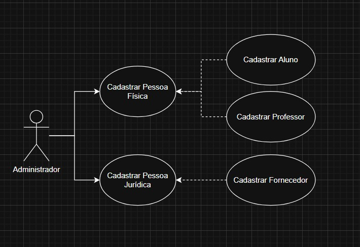
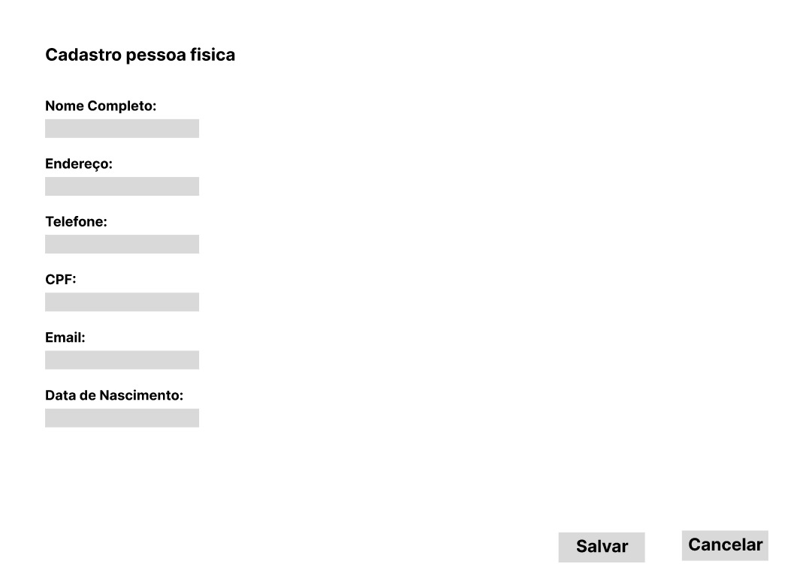
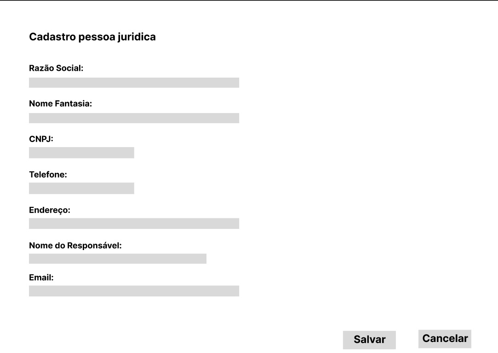
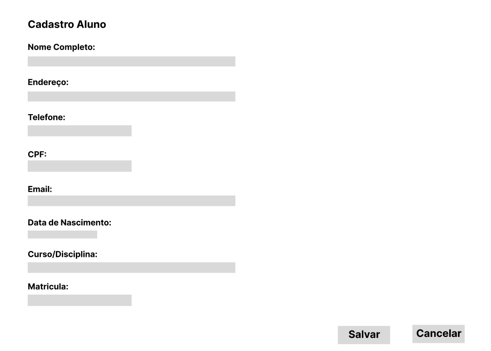
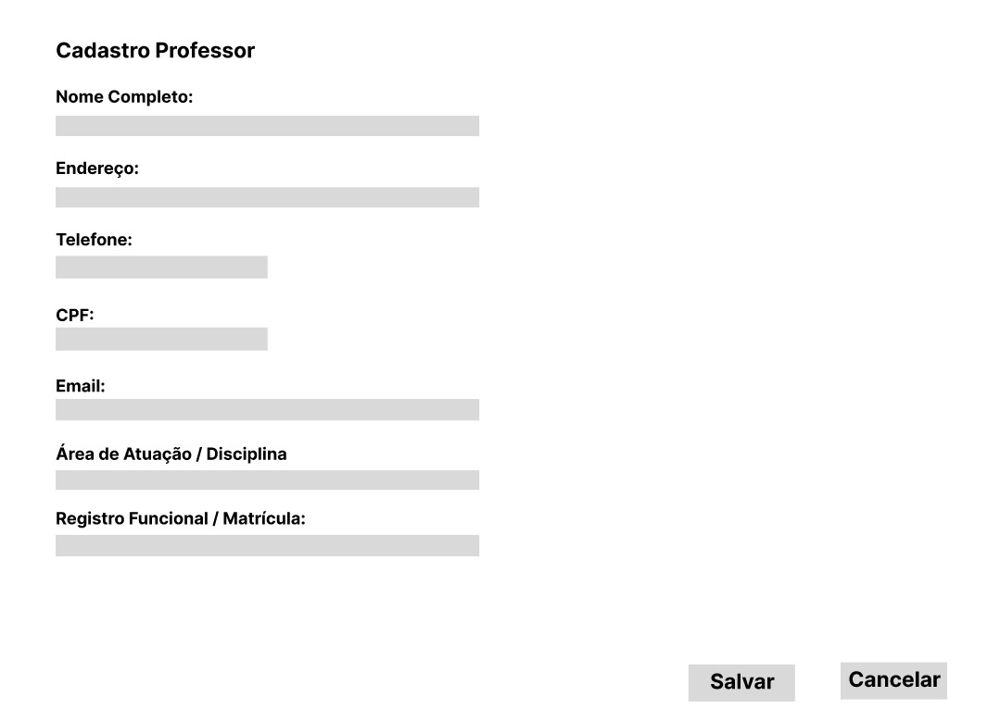
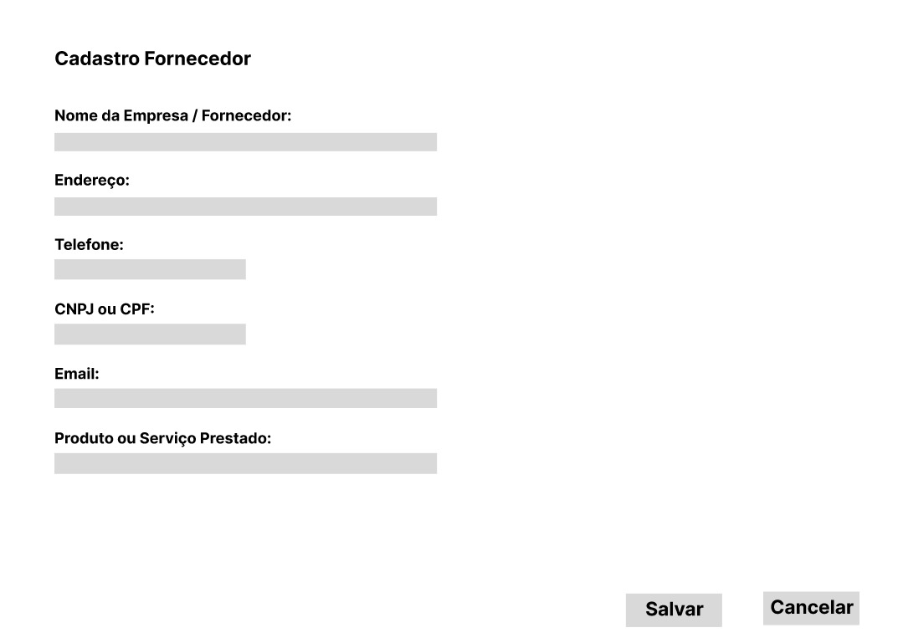

# Projeto Integrador - Sistema de Cadastros Universitários

## 👥 Integrantes
- Sabrina Mukai Nishidate
- Anna Clara Meirelles Ianzer
- Gabriel Oliveira 

---

## 📌 Descrição
Este projeto é parte do **Projeto Integrador** da disciplina de Análise de Sistemas.  
O objetivo é **modelar e prototipar** um sistema orientado a objetos voltado à gestão de dados de uma grande universidade.  

A entrega foi dividida em duas fases:  
- **Fase 1** → Modelagem UML (casos de uso, cenários e diagrama de classes).  
- **Fase 2** → Protótipos funcionais das interfaces, com base nos diagramas criados.  

---

## 📊 Fase 1 - Modelagem UML

### 1. Diagrama de Caso de Uso

---

### [2. Descrição dos Casos de Uso](realização_matricula.md)

### 3. Diagrama de Classes

#### C[odigo utilizado no dbdiagram.io

Table Pessoa {
  id int [pk]
  nome varchar
  endereco varchar
  telefone varchar
  email varchar
}

Table PessoaFisica {
  id int [pk]
  cpf varchar
  dataNascimento date
}

Table PessoaJuridica {
  id int [pk]
  cnpj varchar
  razaoSocial varchar
}

Table Aluno {
  id int [pk]
  matricula varchar
  curso varchar
}

Table Professor {
  id int [pk]
  matricula varchar
  departamento varchar
  especialidade varchar
}

Table Fornecedor {
  id int [pk]
  categoria varchar
  produtoServico varchar
}

Ref: PessoaFisica.id > Pessoa.id

Ref: PessoaJuridica.id > Pessoa.id

Ref: Aluno.id > PessoaFisica.id

Ref: Professor.id > PessoaFisica.id

Ref: Fornecedor.id > PessoaJuridica.id 

## Fase 2 - Protótipos de Interface

Os protótipos foram desenvolvidos no [Figma](https://www.figma.com/proto/PdHoaIL4xZenHj2SN9k1K9/PI---Protótipos-Cadastros?node-id=11-41&p=f&t=irHZogmkbT4IBl6c-0&scaling=min-zoom&content-scaling=fixed&page-id=1%3A2).

### Fluxo do Formulário

Neste projeto, optamos por um fluxo direto de formulário. O usuário acessa o link do formulário e preenche as informações solicitadas.

Acesso: O usuário recebe o link direto e seleciona qual cadastro preencher.

Preenchimento: É possível selecionar categorias como Pessoa Física, Aluno, Professor ou Fornecedor.

Navegação: Ao clicar em Salvar ou Cancelar, o usuário é direcionado automaticamente para a tela inicial.

Progresso: Cada página representa uma etapa do preenchimento; indicativos de progresso podem ser adicionados se necessário.

#### Observações.

O protótipo do Figma reflete exatamente este fluxo, permitindo visualizar as transições entre as páginas.

### Exemplos de Telas

- Cadastro de Pessoa Física  

- Cadastro de Pessoa Jurídica  

- Cadastro Aluno

- Cadastro Professor

- Cadastro Fornecedor

